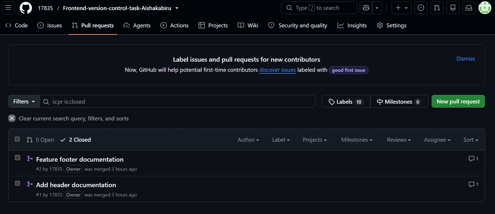

# Frontend-version-control-task-Aishakabiru
A frontend project demonstrating Git and GitHub version control workflows.
# Frontend Version Control Task

## Purpose

This repository demonstrates my understanding of Git and GitHub version control workflows, including branching, commits, pull requests, merging, reverting changes, and branch management.

   Branches

* main  — The main branch containing the completed and merged work.
* feature-header — Used to develop and document the header section.
* feature-footer-updated — Originally named 'feature-footer'; used to develop and document the footer section. The branch was later renamed to demonstrate branch management.

   Pull Requests and Merging

Two feature branches were created, reviewed, and merged into the 'main' branch:

* Add header documentation — Reviewed and merged successfully.
* Add footer documentation — Reviewed and merged successfully.

    Screenshot of Merged Pull Requests



   Git Commands Used Frequently

git clone
git status
git branch
git checkout -b
git add
git commit -m
git push
git pull
git fetch
git branch -m
git revert
```

  Reversion Demonstration

A minor documentation error was intentionally added to `footer.md` and committed. The commit was then reverted using:
git revert <commit-hash>

This demonstrated how Git can undo an unwanted change while preserving the commit history.


 Lessons Learned

~ Git branches allow different features to be developed separately without affecting the main branch.
~ Meaningful commit messages make project history easier to understand.
~ Pull requests provide an opportunity to review changes before merging them.
~ 'git revert' can safely undo a committed change without deleting the existing history.
~ Branches can be renamed locally and updated on the remote repository.
~ 'git fetch' helps keep local information about remote branches up to date.
~ Git and GitHub make collaboration and version control easier to manage.
